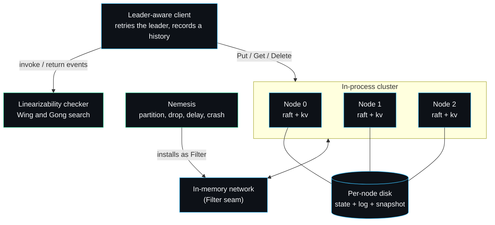

# raftkv

A Raft key-value store with a built-in fault-injection harness that proves linearizability under partitions and crashes.

[](LICENSE)


Most Raft tutorials stop at "the test passed". That never satisfied me, because a green test on a happy network proves almost nothing about a consensus protocol. The interesting question is what the cluster does when the network is on fire. So the centre of gravity in this project is not the Raft code, it is the checker that sits in judgement over it.

Here is the checker catching a register that lied. The history below is hand-built so the operations do not overlap in time: a write of `1` completes, a write of `2` completes, then a read returns `1`. A correct single-copy register cannot do that, and the checker says so.

```go
h := linz.NewHistory()
id := h.Invoke(linz.Op{Kind: linz.OpPut, Key: "x", Value: "1"}); h.Return(id, "1", true)
id = h.Invoke(linz.Op{Kind: linz.OpPut, Key: "x", Value: "2"}); h.Return(id, "2", true)
id = h.Invoke(linz.Op{Kind: linz.OpGet, Key: "x"});            h.Return(id, "1", true) // stale
fmt.Println(linz.Check(h))
```

```
linearizable=false key="x"
no sequential ordering consistent with real-time order
```

That snippet is a real, runnable example test (`linz/ExampleCheck_staleRead`); its expected output is pinned, so `go test ./linz/` fails if the checker ever stops rejecting it. The same checker runs over every recorded history the chaos suite produces. When the real cluster is healthy it returns `linearizable=true`; if the consensus code ever served a stale or invented value, this is the line that would turn red.

## Why I built this

I had implemented Raft once before, the way most people do: follow the paper, write a few tests that elect a leader and replicate a value, watch them go green, move on. Months later I genuinely could not tell you whether that implementation was correct under a partition, because I had never put it under one. The tests only ever exercised the path the paper draws on its happy diagram.

This time I inverted the priorities. I wrote the linearizability checker and the fault harness first, treated them as the product, and built the Raft core to satisfy them. The rule I held myself to was that no consistency claim ships without a recorded history a checker has accepted. The result is a from-scratch Raft with leader election, log replication, persistence and snapshots, sitting under a Jepsen-style nemesis and a Wing and Gong linearizability checker, all on the Go standard library with nothing to `go get`.

## How the pieces fit



Each node runs the consensus core (`raft/`) and feeds committed commands to a key-value state machine (`kv/`). Nodes only ever reach each other through a `Transport` interface, so the in-memory network (`cluster/`) can splice in a `Filter` that the fault harness (`fault/`) uses to injure traffic without the Raft code ever knowing it is being attacked. The client records every operation into a history that the checker (`linz/`) judges. The full design rationale, including the seam that makes this possible, is in the [Architecture wiki page](https://github.com/sarmakska/raftkv/wiki/Architecture).

## Try it

```bash
git clone https://github.com/sarmakska/raftkv && cd raftkv
go build ./...                              # standard library only, nothing to fetch
go test ./...                               # election, replication, crash recovery, snapshots, the checker
go run ./cmd/raftkvd -nodes 5 -ops 200      # a 5-node cluster under chaos, checked at the end
```

The demo boots a cluster, starts the nemesis, drives a workload through the leader-aware client, then prints the verdict:

```
raftkv: started 5-node cluster in /tmp/raftkvd...
raftkv: leader elected: node 2
raftkv: nemesis running (partitions, delays, crashes)
raftkv: ran 200 operations
raftkv: history is LINEARIZABLE
```

## The packages

- `raft/` is the consensus core: randomised-timeout elections with a pre-vote phase, log replication with fast conflict backtracking, the term and commit-index commitment rules, crash-safe persistence of term, vote and log, and log compaction via `InstallSnapshot`. `raft/read.go` holds the read-index path for linearizable reads.
- `kv/` is the replicated state machine: Get, Put, Delete, plus snapshot and restore for compaction.
- `cluster/` is the in-process multi-node cluster, the in-memory network with its fault seam, and the leader-aware client that retries the leader and reads through the read index.
- `fault/` is the harness: an `Injector` that partitions, drops, delays and reorders, and a `Nemesis` that schedules faults against a live cluster.
- `linz/` is the history recorder and the checker.
- `cmd/raftkvd/` wires it together for the demo above.

## Linearizable reads, and why not a simpler scheme

Reads go through Raft's read-index path (paper section 6.4), not through the log. The leader holds a lease strictly shorter than the minimum election timeout, renewed when a majority acknowledges a heartbeat, so while the lease is valid it can answer reads immediately because no one else can have been elected. When the lease has lapsed it confirms leadership with a fresh heartbeat round before answering. A no-op committed at the start of each term guarantees the read index reflects the current term.

## Design decisions

A few choices here went against the obvious option, and those are the ones worth explaining.

**Read-index over leader leases alone.** The tempting shortcut for fast reads is a pure leader lease: trust a wall-clock timer, skip the read index, answer locally. I rejected that as the only mechanism because it makes correctness depend on bounded clock drift between machines, and a paused VM or an NTP step quietly breaks linearizability with no way for the checker to have caught it in a deterministic test. So the lease here is an optimisation layered on top of the read index, never a replacement for it. Under the lease a read is local and fast; without it the leader pays for a heartbeat round. Correctness never rests on the clock alone.

**Wing and Gong search over a Knossos-style linear-extension solver.** The well-known checkers (Knossos, Porcupine) are excellent, but they are also large bodies of someone else's code, and pulling one in would have meant the proof was outsourced. The point of this project is that I can demonstrate the property, so I implemented the classic Wing and Gong backtracking search myself, partitioned per key with memoisation on (linearized set, model state). It is enough for the history sizes a test produces and it is small enough to read in one sitting. Porcupine is the right answer if you need to check million-operation histories; that is explicitly not what this is.

**A single mutex per node over a channel-per-actor design.** Go nudges you toward modelling each node as a goroutine that owns its state and communicates over channels. I tried it and the code drifted away from the paper, turning Raft's already-subtle invariants into a message-ordering puzzle on top. I went back to one `sync.Mutex` per node with internal helpers suffixed `Locked`, so the code reads next to the paper's pseudocode and the lock discipline is obvious. The trade-off is that I cannot fan out RPCs while holding the lock, so sends happen on goroutines that re-acquire only to apply the reply.

**A custom append-only log over an embedded database.** I could have persisted the log to SQLite or bbolt and saved myself the recovery code. I wrote a length-prefixed, CRC-checked append-only file instead, because torn-write recovery from a crash is part of what I wanted to demonstrate, and burying it inside a database would have hidden the one mechanism a reviewer most wants to see. `TestTornTrailingRecordDiscarded` appends garbage to simulate a crash mid-write and asserts the log drops the torn record cleanly on reopen, keeping the good entries.

## Numbers

Measured on an Apple M3 Pro, Go 1.26.3, with the fast test timeouts (30 ms heartbeat). Reproduce with:

```bash
go test ./cluster/ -bench Benchmark -run '^$' -benchmem
```

| Workload | Result |
| --- | --- |
| Linearizable read under the leader lease | 457 ns/op, 0 allocs |
| Committed write, 3 nodes | 11.9 ms/op, 68 allocs |
| 200-op workload under the nemesis (5 nodes) | linearizable, checked every run |

The write figure is dominated by the heartbeat-driven replication cycle in the test configuration: a write waits for the next heartbeat to carry it to a majority, and the heartbeat interval is 30 ms here. Production timeouts and entry batching would cut that sharply. Reads under the lease never leave the leader, which is why they are sub-microsecond. These are the actual numbers from the run above, not projections.

## Limitations and non-goals

This is a correctness-first, teaching-grade implementation, and some things are deliberately out of scope:

- The transport is in-process. There is a `Transport` interface and a real gRPC or TCP implementation would slot in behind it, but I have not written one and the numbers above would change once a real network is involved.
- Membership is static. No dynamic reconfiguration (joint consensus) yet; the node set is fixed at startup.
- The on-disk format favours clarity over speed. JSON for state and snapshots, a hand-rolled binary log. Fine for correctness work, not tuned for throughput.
- No client sessions or idempotency keys, so an unconfirmed write that the client retries can apply twice. The checker models this honestly (an unconfirmed write may or may not have taken effect), which is why it stays sound, but it is not exactly-once.

What I will add: a real network transport behind the existing seam, and a recorded chaos run with its seed checked into the repo so a violation, if one ever surfaced, would be replayable bit for bit. What I will not add: a SQL layer, a wire-compatible clone of an existing store, or a benchmark chase. The roadmap lives in the [wiki](https://github.com/sarmakska/raftkv/wiki).

## Tests

37 tests across the packages cover leader election, election after a partition, log convergence after a heal, leadership change, recovery of committed entries from disk after a crash, snapshot install to a lagging follower, torn-write recovery, and the checker accepting valid histories while rejecting stale reads, phantom reads and a corrupted history. The fault harness itself is pinned down directly: a seeded suite asserts that a partition is a hard symmetric cut, that an unlisted node stays connected, that `Isolate` cuts exactly one node, that `Heal` restores the cluster, that the drop rate is honoured and exactly reproducible under a fixed seed, and that delays always land inside the configured window. The flagship `TestLinearizableUnderChaos` then drives a workload while the nemesis injects faults and asserts the recorded history is linearizable. `go test -race ./...` is clean.

## Documentation

The [wiki](https://github.com/sarmakska/raftkv/wiki) is the real reference and goes deep across more than twenty pages: the [Architecture](https://github.com/sarmakska/raftkv/wiki/Architecture), a [Raft walkthrough](https://github.com/sarmakska/raftkv/wiki/Raft-Walkthrough) tied to the code, the [read-index and leases](https://github.com/sarmakska/raftkv/wiki/Read-Index-and-Leases) path, [snapshots and compaction](https://github.com/sarmakska/raftkv/wiki/Snapshots-and-Compaction), the [storage engine](https://github.com/sarmakska/raftkv/wiki/Storage-Engine) and [wire formats](https://github.com/sarmakska/raftkv/wiki/Wire-Formats-and-Data-Layout), the [transport seam](https://github.com/sarmakska/raftkv/wiki/Transport-and-Network), the [fault harness](https://github.com/sarmakska/raftkv/wiki/Fault-Injection-Harness), the [linearizability checker](https://github.com/sarmakska/raftkv/wiki/Linearizability-Checker), the [client API](https://github.com/sarmakska/raftkv/wiki/Client-API), [configuration and tuning](https://github.com/sarmakska/raftkv/wiki/Configuration-and-Tuning), [performance and benchmarks](https://github.com/sarmakska/raftkv/wiki/Performance-and-Benchmarks), the [testing strategy](https://github.com/sarmakska/raftkv/wiki/Testing-Strategy), [design decisions](https://github.com/sarmakska/raftkv/wiki/Design-Decisions), [comparisons](https://github.com/sarmakska/raftkv/wiki/Comparisons), [troubleshooting](https://github.com/sarmakska/raftkv/wiki/Troubleshooting), an [FAQ](https://github.com/sarmakska/raftkv/wiki/FAQ) and the [roadmap](https://github.com/sarmakska/raftkv/wiki/Roadmap).

## Licence

MIT. See [LICENSE](LICENSE).

---
Built by Sarma. Part of the SarmaLinux open-source line.
Website: https://sarmalinux.com  .  GitHub: https://github.com/sarmakska
