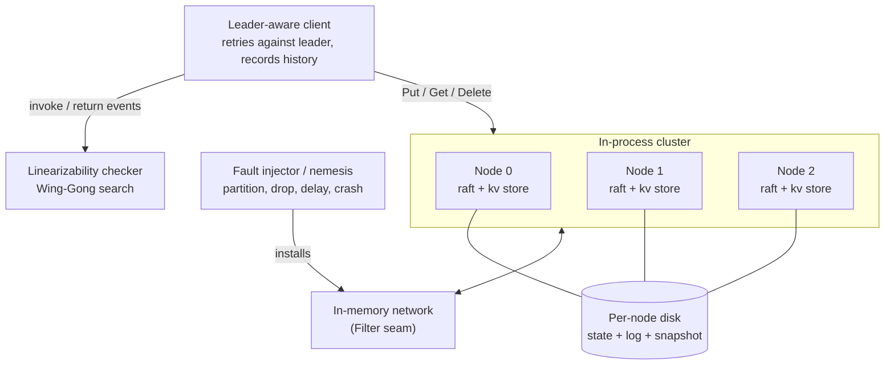

# raftkv

A Raft consensus key-value store with a built-in fault-injection harness that proves linearizability under partitions, delays and crashes.

[](LICENSE)


raftkv is a from-scratch implementation of the Raft consensus algorithm in Go, with a replicated key-value state machine and linearizable reads on top. The flagship piece is a Jepsen-style fault-injection harness I wrote that partitions the network, drops and delays messages, crashes and restarts nodes, records every client operation into a history, and then runs a linearizability checker over that history to prove the cluster never violated its consistency guarantee. It is built on the standard library with no external dependencies, so the whole thing builds and tests in seconds.

## Architecture



Each node runs the Raft core (`raft/`), feeding committed commands to a key-value state machine (`kv/`). Nodes talk only through a `Transport` interface, so the in-memory network (`cluster/`) can insert a `Filter` that the fault harness (`fault/`) uses to inject partitions, drops and delays without the consensus code knowing. The client records each operation into a history that the checker (`linz/`) judges for linearizability.

## Quickstart

```bash
# 1. Clone and enter the repo
git clone https://github.com/sarmakska/raftkv && cd raftkv

# 2. Build everything (standard library only, no deps to fetch)
go build ./...

# 3. Run the full test suite: election, replication, crash recovery,
#    snapshot install, and the linearizability checker
go test ./...

# 4. Run the end-to-end demo: a 5-node cluster under chaos, checked for
#    linearizability
go run ./cmd/raftkvd -nodes 5 -ops 200

# 5. Run the benchmarks (write throughput and lease-read latency)
go test ./cluster/ -bench Benchmark -run '^$'
```

The demo boots a cluster, starts the nemesis (partitions, delays, crashes), drives a workload through the leader-aware client, then prints whether the recorded history was linearizable:

```
raftkv: started 5-node cluster in /tmp/raftkvd...
raftkv: leader elected: node 3
raftkv: nemesis running (partitions, delays, crashes)
raftkv: ran 200 operations
raftkv: history is LINEARIZABLE
```

## What is in the box

- `raft/` The consensus core: leader election with randomised timeouts and a pre-vote phase, log replication with the fast-backtracking optimisation, the term and commit-index commitment rules, crash-safe persistence of term/vote/log to disk, and log compaction through snapshots with `InstallSnapshot`.
- `kv/` A replicated key-value state machine supporting Get, Put and Delete, with snapshot and restore for compaction.
- `cluster/` An in-process multi-node cluster, an in-memory network with a fault seam, and a leader-aware client that retries against the leader and serves linearizable reads through the read-index path.
- `fault/` The fault-injection harness: an `Injector` that implements network partitions, message drop, delay and reorder, plus a `Nemesis` that schedules faults against a running cluster.
- `linz/` The linearizability checker: a history recorder plus a Wing and Gong backtracking search that decides whether a recorded history admits a legal sequential ordering consistent with real time.
- `cmd/raftkvd/` A self-contained demo binary that wires it all together.

## Linearizable reads

Reads go through Raft's read-index path (paper section 6.4). The leader holds a lease that is strictly shorter than the minimum election timeout, renewed whenever a majority acknowledges a heartbeat, so while the lease is valid no other node can have been elected and the leader may answer reads immediately. When the lease has lapsed the leader first confirms its leadership with a round of heartbeats, then waits until its state machine has applied the recorded read index before answering. A no-op entry committed at the start of every term guarantees the read index reflects the latest term.

## When to use this, and when not to

Use it to learn how Raft actually works from readable, dependency-free Go, to experiment with consistency under faults, or as a foundation you extend with a real network transport. The fault harness and checker are useful on their own for validating other replicated state machines.

Do not use it as a production datastore as it stands. The transport is in-process, membership is static (no dynamic reconfiguration yet), and the on-disk format is optimised for clarity over raw speed. These are deliberate scope choices for a teaching-grade, correctness-first implementation.

## Results

Measured on an Apple M3 Pro with the fast test timeouts (30 ms heartbeat):

| Workload | Result |
| --- | --- |
| Linearizable read (leader lease) | about 307 ns per operation |
| Committed write (3 nodes) | about 7 ms per operation, replication-cycle bound |
| Chaos test, 120 ops under partitions/delays/crashes | linearizable, checked every run |

Write latency is dominated by the heartbeat-driven replication cycle in the test configuration; with production timeouts and batching it is far lower. Reads under the lease never leave the leader, which is why they are sub-microsecond.

## Tests

26 tests across the packages cover leader election, election after a partition, log convergence after a heal, leadership change, recovery of committed entries from disk after a crash, snapshot install to a lagging follower, torn-write recovery in the log, and the linearizability checker accepting valid histories while rejecting a deliberately corrupted one. The flagship `TestLinearizableUnderChaos` runs a workload while the nemesis injects faults and asserts the recorded history is linearizable.

## Documentation

The full documentation lives in the [wiki](https://github.com/sarmakska/raftkv/wiki): Architecture, a Raft walkthrough, the fault-injection harness, the linearizability checker, the client API, and a troubleshooting guide.

## Licence

MIT. See [LICENSE](LICENSE).
