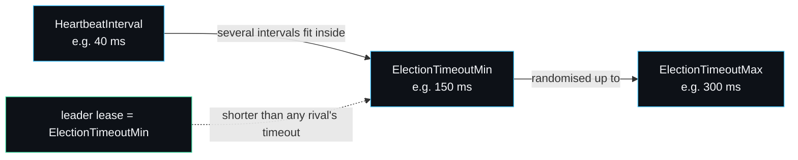

# Configuration and Tuning

There are two configuration surfaces: `cluster.Options`, which you set when you build a cluster, and `raft.Config`, which the cluster fills in per node from those options. This page documents every field, its safe range, and the relationships that actually matter. The defaults live in `cluster.DefaultOptions` and the demo's flags in `cmd/raftkvd/main.go`.

## cluster.Options

```go
type Options struct {
    N                  int
    Dir                string
    HeartbeatInterval  time.Duration
    ElectionTimeoutMin time.Duration
    ElectionTimeoutMax time.Duration
    SnapshotThreshold  uint64
}
```

| Field | Default | What it does | Guidance |
| --- | --- | --- | --- |
| `N` | (required) | Number of nodes. | Use an odd number so a majority is unambiguous. 3 tolerates one failure, 5 tolerates two. |
| `Dir` | (required) | Root directory; each node gets `node-<id>/`. | Must persist across a `Crash`/`Restart` or recovery is impossible. |
| `HeartbeatInterval` | 40 ms | How often the leader sends heartbeats. | The smallest of the three timers. Drives replication latency in the test config. |
| `ElectionTimeoutMin` | 150 ms | Lower bound of the randomised election timeout. Also the leader-lease length. | Keep at three to five times `HeartbeatInterval`. |
| `ElectionTimeoutMax` | 300 ms | Upper bound of the randomised election timeout. | Keep comfortably above `Min` so nodes do not time out in lockstep. |
| `SnapshotThreshold` | 0 (off) | Applied entries past the last snapshot before compacting. | 0 disables snapshotting. A few thousand is reasonable; the tests use 20 to force the path quickly. |

`DefaultOptions(n, dir)` returns the values above. The test helper `fastOpts` shrinks them further (30 ms / 120 ms / 250 ms) so a cluster's worth of elections runs in milliseconds.

## raft.Config

The cluster derives `raft.Config` per node; you only touch it directly if you embed the `raft` package without the cluster. The extra fields are `ID`, `Peers` (all node ids including this one), `Storage`, `Transport`, `ApplyCh`, and the same three timers plus `SnapshotThreshold`.

## The one ratio that matters

The single relationship that governs stability is heartbeat versus election timeout.



A leader must be able to land several heartbeats inside one follower's election timeout, so an ordinary scheduling hiccup or a single dropped heartbeat does not look like a dead leader. If `ElectionTimeoutMin` is too close to `HeartbeatInterval`, transient delays trigger spurious elections, the cluster churns leaders, and clients see intermittent `ErrNoLeader`. Three to five times is the sweet spot. The gap between `Min` and `Max` is what desynchronises candidates so a split vote resolves quickly rather than repeating.

The leader lease is exactly `ElectionTimeoutMin`. Because the lease is renewed on a majority heartbeat ack and is no longer than the minimum election timeout, no rival can have won an election while a lease is valid. Shrinking `ElectionTimeoutMin` shrinks the lease and pushes more reads onto the heartbeat-reconfirm path (see [[Read-Index-and-Leases]]).

## Snapshot threshold

`SnapshotThreshold` trades log length against snapshot frequency.

- **0** disables automatic snapshotting. The log grows without bound, which is fine for short runs and the default for tests that do not exercise compaction.
- **Low (tens)** forces frequent compaction, useful in tests like `TestSnapshotInstall` to provoke an `InstallSnapshot` quickly. In production this would waste work, because the whole state machine is serialised on each snapshot (see [[KV-State-Machine]]).
- **Higher (thousands)** keeps the log bounded while snapshotting rarely. Pick it so a snapshot covers far more entries than a typical lagging follower is behind, so the common catch-up path stays `AppendEntries` and only a badly-lagging follower needs a full snapshot install.

## Client timeout

`cluster.NewClient(c, timeout, history)` takes a per-operation timeout. It bounds how long `Put`, `Delete` and `Get` retry across leader changes before returning `ErrNoLeader`. Set it well above one election window (`ElectionTimeoutMax` plus a margin) so a single election does not surface as a client error. The demo uses 5 seconds; the tests use 3 to 5 seconds.

## A worked example

For a real-ish three-node deployment on a LAN you might use:

```go
opts := cluster.Options{
    N:                  3,
    Dir:                "/var/lib/raftkv",
    HeartbeatInterval:  50 * time.Millisecond,
    ElectionTimeoutMin: 250 * time.Millisecond, // 5x heartbeat, also the lease
    ElectionTimeoutMax: 500 * time.Millisecond,
    SnapshotThreshold:  4096,
}
client := cluster.NewClient(c, 3*time.Second, nil)
```

These are illustrative; the in-process transport means absolute latencies reflect goroutine scheduling, not a wire (see [[Performance-and-Benchmarks]] and the [[Roadmap]]). The ratios, not the absolute values, are what carry over to a real transport.

If you hit trouble, [[Troubleshooting]] maps symptoms (no leader, churn, lost data, slow checker) back to these settings.

---
SarmaLinux . sarmalinux.com . [raftkv on GitHub](https://github.com/sarmakska/raftkv)
