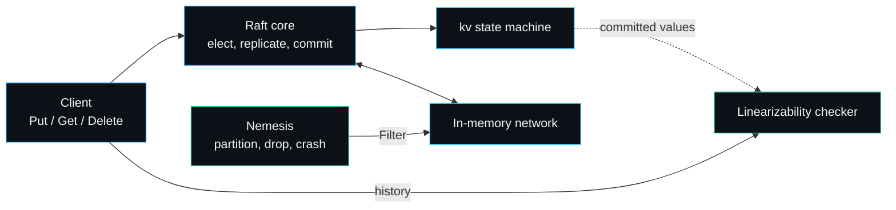

# raftkv

raftkv is a from-scratch Raft consensus key-value store in Go, paired with a fault-injection harness that proves the cluster stays linearizable while the network is partitioned, messages are dropped and delayed, and nodes crash and restart. I built it to show that I can implement a distributed consensus protocol correctly and, just as importantly, prove it correct rather than assert it. Everything here is the Go standard library; there is nothing to `go get`.



A write travels from the client through the Raft core, is replicated and committed across a majority, then applied to the key-value state machine. Every operation is recorded into a history. While the workload runs the nemesis injures the network and crashes nodes; at the end the checker proves no client ever saw a value a correct single-copy register could not have produced.

## How to read this wiki

The pages are layered. If you want the shape of the system, read [[Architecture]] and stop. If you want to understand the protocol, follow the consensus-core pages in order. If you want to operate or extend it, the operating and reference pages stand alone. The sidebar groups them; the table below is the same set with a sentence each.

| Page | What it covers |
| --- | --- |
| [[Architecture]] | How the seven packages fit, the transport seam, the concurrency model, persistence, and the decisions made against the obvious alternatives. |
| [[Raft-Walkthrough]] | Election with pre-vote, replication and fast backtracking, commitment, persistence and snapshots, each tied to the function that implements it. |
| [[Read-Index-and-Leases]] | The linearizable-read path: the leader lease, the read index, the no-op anchor, and why correctness never rests on the clock alone. |
| [[Snapshots-and-Compaction]] | How the log is compacted, when a snapshot is taken, and how `InstallSnapshot` catches up a follower behind the compacted prefix. |
| [[Storage-Engine]] | `FileStorage`: the append-only CRC log, atomic JSON state and snapshot files, replay, torn-write recovery, and the `Storage` contract. |
| [[Wire-Formats-and-Data-Layout]] | Exact byte layout of `log.bin`, the JSON shapes of `state.json` and `snapshot.json`, and every RPC argument and reply. |
| [[Transport-and-Network]] | The `Transport` and `Handler` interfaces, the in-memory `Network`, the `Filter` seam, and the routing path of an RPC. |
| [[KV-State-Machine]] | The replicated register store: command encoding, apply semantics, no-op handling, snapshot and restore. |
| [[Client-API]] | Driving a cluster from Go: starting it, writes, linearizable reads, crash and restart, inspecting state, tuning timeouts. |
| [[Fault-Injection-Harness]] | The Jepsen-style nemesis and injector, the fault menu, determinism, and why injecting at the network seam keeps the bugs real. |
| [[Linearizability-Checker]] | The Wing and Gong search, a worked violation it catches, the per-key partition, memoisation, and its failure modes. |
| [[Testing-Strategy]] | The full test inventory by package, what each test pins, the race detector, and how the flagship chaos test is built. |
| [[Configuration-and-Tuning]] | Every `Options` and `Config` field, safe ranges, the heartbeat-to-election ratio, and snapshot threshold choices. |
| [[Performance-and-Benchmarks]] | Real numbers from an Apple M3 Pro, what dominates each one, and how to reproduce them. |
| [[Troubleshooting]] | Concrete symptoms and their fixes, from "no leader" to a slow checker. |
| [[Security-Model]] | The trust boundary, what is and is not in scope, durability as a safety property, and reporting. |
| [[Examples-and-Recipes]] | Copy-paste recipes: a three-node cluster, a recorded chaos run, a manual partition, forcing a snapshot install. |
| [[Writing-a-Transport]] | How to put raftkv on a real network behind the existing seam, with the contract a transport must honour. |
| [[Design-Decisions]] | The trade-offs in one place, each with the alternative I rejected and why. |
| [[Comparisons]] | How raftkv relates to etcd, hashicorp/raft, Porcupine, Knossos and Jepsen, and where it deliberately differs. |
| [[Roadmap]] | What I will add, what I will not, and the honest limitations. |
| [[Glossary]] | Every term of art used across these pages, defined once. |
| [[FAQ]] | The questions a serious reader asks first. |

## What raftkv guarantees

- Linearizable writes and reads while a majority of nodes are reachable.
- Committed entries survive crashes, because term, vote and log are flushed to disk before being acknowledged.
- A node that has fallen behind the compacted log prefix is caught up with a snapshot.
- No stale or invented value is ever returned, which the checker verifies on every chaos run.

It is not a production datastore. The transport is in-process, membership is static, and the on-disk format favours clarity over speed. Those are deliberate choices for a correctness-first implementation; the [[Roadmap]] is honest about the rest.

## Quickstart

```bash
git clone https://github.com/sarmakska/raftkv && cd raftkv
go build ./...
go test ./...
go run ./cmd/raftkvd -nodes 5 -ops 200
```

The demo boots a five-node cluster, runs the nemesis, drives a workload, and prints whether the recorded history was linearizable. A healthy run ends with `raftkv: history is LINEARIZABLE`.

## Repository at a glance

| Package | Lines | Role |
| --- | --- | --- |
| `raft` | ~1060 | Consensus core (`raft.go`, `read.go`) and crash-safe `FileStorage` (`storage.go`). |
| `cluster` | ~540 | In-process cluster, in-memory network, leader-aware client. |
| `fault` | ~210 | Injector and nemesis. |
| `linz` | ~260 | History recorder and Wing and Gong checker. |
| `kv` | ~100 | Replicated register store. |
| `transport` | ~90 | RPC types and the `Transport`/`Handler` interfaces. |
| `cmd/raftkvd` | ~90 | The demo binary. |

---
SarmaLinux . sarmalinux.com . [raftkv on GitHub](https://github.com/sarmakska/raftkv)
