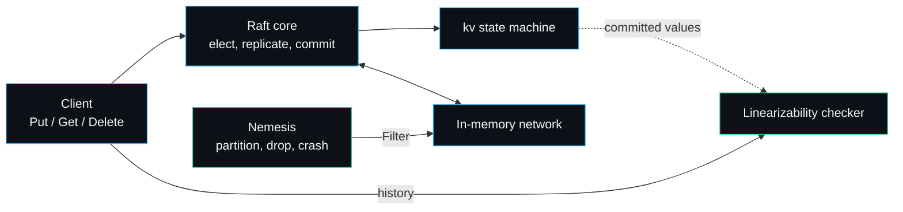

# raftkv

raftkv is a from-scratch Raft consensus key-value store in Go, paired with a fault-injection harness that proves the cluster stays linearizable while the network is partitioned, messages are dropped and delayed, and nodes crash and restart. I built it to show that I can implement a distributed consensus protocol correctly and, just as importantly, prove it correct rather than assert it.



A write travels from the client through the Raft core, is replicated and committed across a majority, then applied to the key-value state machine. Every operation is recorded into a history. While the workload runs the nemesis injures the network and crashes nodes; at the end the checker proves no client ever saw a value a correct single-copy register could not have produced.

## Where to go next

| Page | What it covers |
| --- | --- |
| [[Architecture]] | How the packages fit, the transport seam, the concurrency model, and the decisions I made against the obvious alternatives. |
| [[Raft-Walkthrough]] | Election with pre-vote, replication and fast backtracking, persistence, and snapshots, each tied to the function that implements it. |
| [[Fault-Injection-Harness]] | The Jepsen-style nemesis, and why injecting at the network seam keeps the bugs real. |
| [[Linearizability-Checker]] | The Wing and Gong search, a worked example of a violation it catches, and its failure modes. |
| [[Client-API]] | Driving a cluster from Go: starting it, writes, linearizable reads, crash and restart, tuning timeouts. |
| [[Troubleshooting]] | Concrete symptoms and their fixes, from "no leader" to a slow checker. |
| [[Roadmap]] | What I will add, what I will not, and the honest limitations. |

## What raftkv guarantees

- Linearizable writes and reads while a majority of nodes are reachable.
- Committed entries survive crashes, because term, vote and log are flushed to disk before being acknowledged.
- A node that has fallen behind the compacted log prefix is caught up with a snapshot.
- No stale or invented value is ever returned, which the checker verifies on every chaos run.

It is not a production datastore. The transport is in-process, membership is static, and the on-disk format favours clarity over speed. Those are deliberate choices for a correctness-first implementation; the [[Roadmap]] is honest about the rest.

## Quickstart

```bash
git clone https://github.com/sarmakska/raftkv && cd raftkv
go build ./...
go test ./...
go run ./cmd/raftkvd -nodes 5 -ops 200
```

The demo boots a five-node cluster, runs the nemesis, drives a workload, and prints whether the recorded history was linearizable.

---
SarmaLinux . sarmalinux.com . [raftkv on GitHub](https://github.com/sarmakska/raftkv)
