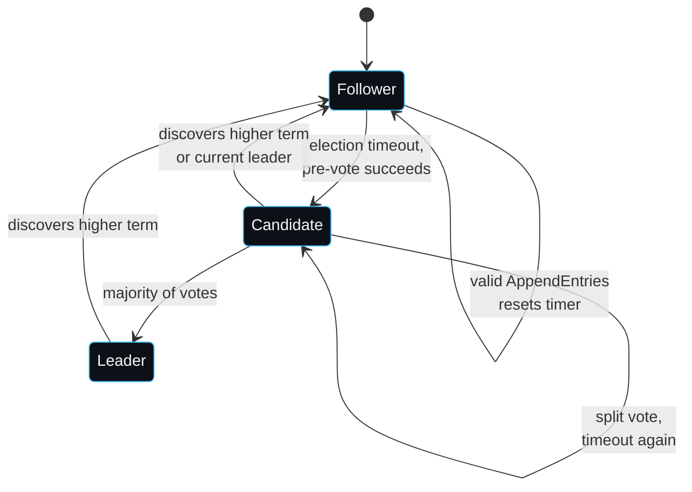

# Raft Walkthrough

This page ties the Raft protocol to the code in `raft/`. It assumes familiarity with the [Raft paper](https://raft.github.io/raft.pdf); the section numbers below refer to it.

## State machine of a node

A node starts as a `Follower`. If it does not hear from a leader before its randomised election deadline it tries to become a `Candidate`, but only after a pre-vote round succeeds. A candidate that wins a majority becomes `Leader`; any node that sees a higher term steps down to follower.

## Leader election

The election timer is randomised in `[ElectionTimeoutMin, ElectionTimeoutMax]` so that nodes rarely time out together (`resetElectionTimer`). When the timer fires, `startElectionLocked` runs.

### Pre-vote

Before bumping its term, a candidate runs a pre-vote round (`runPreVoteLocked`). It asks peers "would you vote for me at term+1?" without anyone changing persistent state. A peer grants a pre-vote only if the candidate's log is at least as up to date as its own and the peer is not currently a leader (`HandleRequestVote` with `args.PreVote`). This is the mechanism from section 9.6 that stops a node isolated by a partition from disrupting a healthy cluster: when it rejoins, its term may be far ahead, but it cannot win a pre-vote because its log is stale, so it never forces a re-election.

### The real vote

If pre-vote succeeds, the candidate increments `currentTerm`, votes for itself, persists that, and sends `RequestVote` to every peer. A peer grants its vote if it has not already voted this term and the candidate's log is at least as up to date, judged by last log term then last log index (`candidateUpToDateLocked`, section 5.4.1). On a majority the candidate calls `becomeLeaderLocked`.

### The new-leader no-op

A fresh leader immediately appends a no-op entry for its term (`becomeLeaderLocked` calls `appendCommandLocked(nil)`). This is the section 5.4.2 fix: a leader may only mark entries from prior terms committed once it has committed an entry from its own term. The no-op gives it that entry, and it also anchors the read-index path (see [[Client-API]]).

## Log replication

`Node.Propose` appends a command to the leader's log and triggers replication. `broadcastAppendLocked` sends each follower an `AppendEntries` built by `sendToPeerLocked`, which carries the entries the follower is missing plus the `PrevLogIndex`/`PrevLogTerm` consistency check.

### Consistency check and fast backtracking

`HandleAppendEntries` rejects the request if it does not have a matching entry at `PrevLogIndex`. Rather than backing up one entry per round trip, the follower returns a conflict hint: the term of the conflicting entry and the first index of that term (`ConflictTerm`, `ConflictIndex`). The leader uses `backtrackLocked` to jump `nextIndex` back to the right place in a single step. This is the optimisation described at the end of section 5.3 and it is what keeps convergence after a heal fast.

### Commitment

`advanceCommitLocked` moves `commitIndex` to the highest index replicated on a majority, but only for entries from the current term (section 5.4.2). Followers learn the commit index from the `LeaderCommit` field and advance their own in `maybeAdvanceFollowerCommitLocked`. Once `commitIndex` moves, the apply loop wakes and delivers the newly committed entries to the state machine.

## Persistence and crash recovery

Term and vote are persisted before any vote is granted; log entries are flushed with `fsync` before `AppendEntries` is acknowledged. On restart, `NewFileStorage` replays `log.bin`, validating each record's CRC and length, and discards a torn trailing record. The node then re-derives `commitIndex` and `lastApplied` from the snapshot and lets the next leader's no-op drive the apply loop to repopulate the state machine. The test `TestRecoveryOfCommittedEntriesFromDisk` crashes and restarts every node and asserts the committed data is intact.

## Snapshots and log compaction

When a node has applied more than `SnapshotThreshold` entries past its last snapshot, `maybeSnapshotLocked` asks the application for a serialised snapshot, persists it, and discards the covered log prefix (`FileStorage.SaveSnapshot`). If a follower then needs entries that have been compacted away, the leader sends `InstallSnapshot` instead of `AppendEntries` (`sendToPeerLocked` falls through to `sendSnapshotLocked`). The follower adopts the snapshot in `HandleInstallSnapshot`, fast-forwards its commit and applied indices, and hands the snapshot to the application. `TestSnapshotInstall` isolates a follower, drives enough writes to force compaction, heals, and asserts the follower is caught up through a snapshot install.

## Failure modes worth knowing

- A node isolated by a partition keeps incrementing its term as it tries and fails to win elections. When it rejoins, its term may be far ahead of everyone else, but pre-vote stops it forcing a re-election because its log is stale. Without pre-vote this is the classic disruptive-rejoin bug.
- A leader that commits an entry, then loses leadership before the no-op of the next term is committed, can leave a committed-but-not-yet-applied gap on followers. The new leader's no-op closes it; this is why a read waits for the apply loop to reach the read index rather than trusting the commit index alone.
- A torn write in `log.bin` from a crash mid-append looks like a short or bad-CRC trailing record and is truncated on open. A corruption in the middle of the log is not recoverable and surfaces as an error from `NewFileStorage`, which is the honest outcome.

---
SarmaLinux . sarmalinux.com . [raftkv on GitHub](https://github.com/sarmakska/raftkv)
