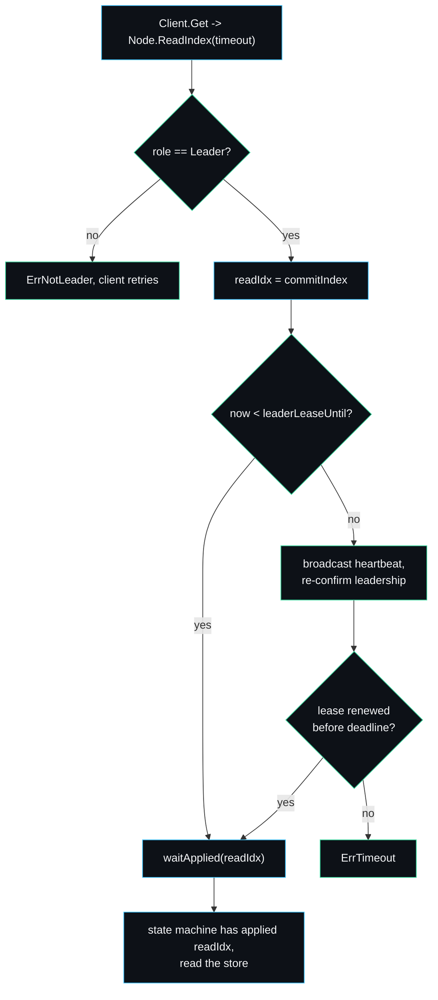

# Read Index and Leases

A linearizable read is harder than it looks. The naive approach, "I am the leader, so I will just read my state machine", is wrong: a node can believe it is still leader for a window after a new leader has been elected on the other side of a partition, and reading its stale state would return a value that a correct register could not. raftkv solves this with the read-index mechanism from the Raft paper section 6.4, with a leader lease as an optimisation on top, never as the sole guarantee. The code is `raft/read.go` and the lease bookkeeping in `raft/raft.go`.

## The two mechanisms



**Read index.** The leader records its current `commitIndex` as the read index, then waits until its state machine has applied at least that index before allowing the read. Because a no-op entry is committed at the start of every term (see [[Raft-Walkthrough]]), the commit index always reflects the current term, so the read index is never stuck behind an old term's tip.

**Leader lease.** The lease is a wall-clock window, `leaderLeaseUntil`, extended to `now + ElectionTimeoutMin` whenever a majority of followers acknowledge a heartbeat (`broadcastAppendLocked` counts acks and sets the lease). While the lease is valid the leader can answer a read immediately, because the lease is strictly shorter than the minimum election timeout, so no other node can have been elected in the meantime.

## The read path step by step

```go
func (n *Node) ReadIndex(timeout time.Duration) (uint64, error) {
    n.mu.Lock()
    if n.role != Leader {
        n.mu.Unlock()
        return 0, ErrNotLeader
    }
    readIdx := n.commitIndex
    leaseOK := time.Now().Before(n.leaderLeaseUntil)
    n.mu.Unlock()

    if leaseOK {
        return n.waitApplied(readIdx, timeout)
    }
    // No valid lease: confirm leadership with a heartbeat round first.
    n.mu.Lock()
    n.broadcastAppendLocked(true)
    n.mu.Unlock()
    // ... poll until the lease is renewed or the deadline passes ...
}
```

When the lease is valid the read is local and cheap: snapshot the commit index, then `waitApplied`. When the lease has lapsed the leader pays for a fresh heartbeat round to reconfirm it still commands a majority, and only then honours the read. If it cannot reconfirm before the deadline it returns `ErrTimeout` and the client retries, which is the correct outcome when leadership is genuinely in doubt.

`waitApplied` polls `lastApplied` until it reaches the read index, bailing out with `ErrNotLeader` if the node stops being leader underneath it. The cluster client layers its own `waitStoreApplied` on top, because the read index is a Raft-level commit position and the client must also wait for the kv apply pump to catch up before reading the store (see [[Client-API]]).

## Why the lease is an optimisation, not the guarantee

This is the design decision I most want to defend. A pure leader lease, trusting a wall-clock timer and skipping the read index entirely, is faster: every read is local and there is never a heartbeat round. I rejected it as the sole mechanism because it ties correctness to bounded clock drift between machines. A paused VM, a long GC, or an NTP step can make a leader believe its lease is still valid after a new leader has been elected, and it would serve a stale read with no deterministic test able to have caught it. So in raftkv the lease never substitutes for the read index; it only decides whether the read index can be honoured immediately or after a reconfirming heartbeat. Correctness rests on the read index and the no-op anchor, which do not depend on clocks. Speed rests on the lease. See [[Design-Decisions]] for the full argument.

## The no-op anchor

`becomeLeaderLocked` appends a `nil`-command entry the moment a node becomes leader. This is the Raft section 5.4.2 fix for committing entries from prior terms, and it doubles as the read-index anchor: once the no-op commits, the commit index reflects the new term, so a read index captured under the new leader is never behind the latest term's writes. The apply pump advances its watermark on the no-op even though it applies nothing (see [[KV-State-Machine]]), which is what lets a read that linearizes just after a leader change make progress instead of blocking on the no-op forever.

## Failure modes worth knowing

- A read on a node that has just lost leadership returns `ErrNotLeader` from `ReadIndex` or `waitApplied`. The client retries against the new leader. No stale value escapes.
- A read during an election, when no lease is valid and the heartbeat round cannot reach a majority, returns `ErrTimeout`. Again the client retries. This is the cluster correctly refusing to answer rather than guessing.
- If `ElectionTimeoutMin` were set absurdly small, the lease window would shrink to near nothing and reads would almost always pay for a heartbeat round. The default ratios keep the lease useful; see [[Configuration-and-Tuning]].

`BenchmarkLinearizableGet` measures the lease-hot path: a read that finds a valid lease and an already-applied index, which is the common case on a healthy cluster. See [[Performance-and-Benchmarks]] for the number and what it means.

---
SarmaLinux . sarmalinux.com . [raftkv on GitHub](https://github.com/sarmakska/raftkv)
