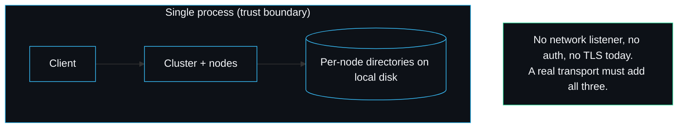

# Security Model

raftkv is a correctness-first consensus library, not a hardened network service, and its security posture should be read in that light. This page states the trust boundary plainly, explains why a consistency bug is treated as a security issue here, and points at the reporting process. The contact and supported versions are in `SECURITY.md` at the repo root.

## The trust boundary

Today every node runs in one process and reaches its peers through the in-memory `Transport` (see [[Transport-and-Network]]). There is no network listener, no authentication, and no encryption, because there is no wire. The trust boundary is the process: anything inside it is trusted. This is appropriate for the project as it stands, which is a library and a test harness, not a deployed service.

When a real network transport lands (see [[Writing-a-Transport]] and the [[Roadmap]]), the boundary moves to the wire and the transport becomes responsible for mutual authentication and confidentiality, most likely mutual TLS, because Raft assumes peers are who they claim to be: a forged `AppendEntries` from a higher term would force a real leader to step down. The consensus core deliberately knows nothing about this, which is why it is the transport's job.

## Durability as a safety property

The strongest safety claim raftkv makes is not about attackers; it is about crashes. Anything acknowledged to a peer or a client is on disk before the acknowledgement (see [[Storage-Engine]]). A power loss can only ever discard work that was never confirmed. The torn-write recovery path (`replayLog`) treats a half-written trailing record as a crash artefact and truncates it, so a crash mid-append cannot corrupt the committed prefix. This is the property `TestTornTrailingRecordDiscarded` and `TestRecoveryOfCommittedEntriesFromDisk` pin.

The honest limit is that a corruption in the *middle* of `log.bin`, as opposed to the trailing record, is outside the failure model and is not recoverable. The CRC per record detects it, but recovery stops at the first bad record. A node whose log is corrupted mid-file should be treated as lost and rebuilt from a peer.

## Why a consistency bug is a security issue

`SECURITY.md` says it directly: a correctness bug that lets the cluster violate linearizability is treated as a security issue, not just a functional one. The reasoning is that the entire value of a consensus store is the consistency guarantee; a stale or invented read is a silent integrity failure, and a system that quietly returns wrong data is more dangerous than one that crashes. The [[Linearizability-Checker]] exists to turn that class of bug into a loud, reproducible failure rather than a silent one, and the chaos suite runs it on every history.

## What is in scope

Per `SECURITY.md`, the consensus core, the persistence layer, the fault-injection harness and the linearizability checker are all in scope for security reports. The kinds of issue that matter most:

- Any input or fault sequence that makes `linz.Check` accept a genuinely non-linearizable history (a false negative in the checker), or reject a legal one in a way that masks a real bug.
- Any crash or fault sequence that lets a committed entry be lost or a stale value be returned.
- Any way to corrupt the on-disk format such that recovery silently drops committed entries rather than failing loudly.

## What is out of scope

- Denial of service from an unbounded workload. There are no rate limits or resource caps; that is a deployment concern a real service layer would add.
- Anything requiring a network attacker, until a real transport exists. There is no network surface to attack today.
- Multi-key transactional invariants. The checker models each key as an independent register (see [[KV-State-Machine]]); cross-key consistency is a non-goal.

## Reporting

Email `security@sarmalinux.com` privately with a description, reproduction steps and impact. Do not open a public issue for a security report. The policy commits to acknowledging within seven days and coordinating a disclosure timeline. Because the project is pre-1.0, fixes land on the latest 0.1.x line.

---
SarmaLinux . sarmalinux.com . [raftkv on GitHub](https://github.com/sarmakska/raftkv)
