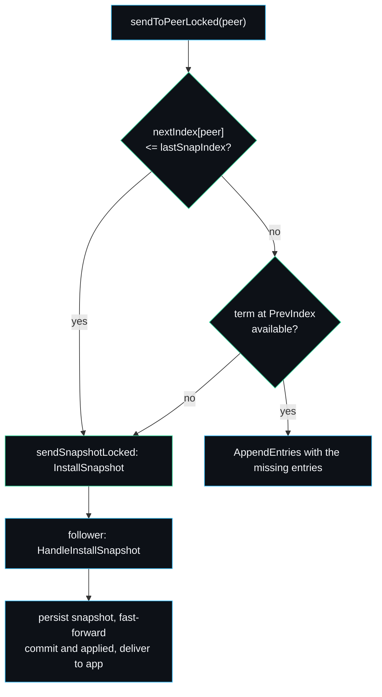

# Snapshots and Compaction

A Raft log that only ever grows is a memory and recovery-time leak. Compaction fixes it: once the state machine has applied a prefix of the log, the entries in that prefix can be replaced by a single snapshot of the state machine, and the entries discarded. raftkv implements this in `maybeSnapshotLocked` (capture), `FileStorage.SaveSnapshot` (persist and discard) and `HandleInstallSnapshot` (catch up a lagging follower). The relevant tunable is `SnapshotThreshold`.

## When a snapshot is taken

After the apply pump advances `lastApplied`, the node checks whether enough entries have accumulated past the last snapshot:

```go
func (n *Node) maybeSnapshotLocked(applied uint64) {
    if n.snapThreshold == 0 || n.snapProvider == nil {
        return
    }
    if applied-n.lastSnapIndex < n.snapThreshold {
        return
    }
    term, ok := n.termAtLocked(applied)
    if !ok { return }
    data := n.snapProvider()                  // ask the application for its bytes
    snap := Snapshot{LastIncludedIndex: applied, LastIncludedTerm: term, Data: data}
    if err := n.storage.SaveSnapshot(snap); err != nil { return }
    n.lastSnapIndex = applied
    n.lastSnapTerm = term
    n.snapData = data
}
```

`snapThreshold` is `Options.SnapshotThreshold`; a zero value disables automatic snapshotting entirely, which is the default for the fast tests. `snapProvider` is the callback registered with `SetSnapshotter`; the cluster wires it to `kv.Store.Snapshot` (see [[KV-State-Machine]]). The node captures the application bytes, persists a `Snapshot` covering everything up to `applied`, and updates its mirrored snapshot bookkeeping.

## How the log is discarded

`FileStorage.SaveSnapshot` persists `snapshot.json` atomically, then drops every in-memory entry at or before `LastIncludedIndex` and rewrites `log.bin` so the file matches:

```go
func (fs *FileStorage) SaveSnapshot(snap Snapshot) error {
    writeJSONAtomic(filepath.Join(fs.dir, snapFile), snap)
    fs.snapshot = snap
    fs.hasSnap = true
    keep := fs.entries[:0:0]
    for _, e := range fs.entries {
        if e.Index > snap.LastIncludedIndex {
            keep = append(keep, e)
        }
    }
    fs.entries = keep
    return fs.rewriteLog()
}
```

After this, `FirstIndex` returns `LastIncludedIndex + 1` and any request for a compacted range from `Entries` returns an error. That error is the signal the leader uses to decide a follower needs a snapshot rather than entries. See [[Storage-Engine]] for the rewrite mechanics.

## Catching up a lagging follower

When the leader prepares to replicate to a peer, `sendToPeerLocked` checks whether the entries the peer needs still exist:



If the peer's `nextIndex` is at or before the snapshot boundary, or the term at the previous index has been compacted away, the leader sends `InstallSnapshot` instead of `AppendEntries`. The follower's `HandleInstallSnapshot`:

1. Steps down if the snapshot carries a higher term, resets its election timer, and records the leader.
2. Ignores a stale snapshot whose `LastIncludedIndex` is at or behind its own.
3. Persists the snapshot through `SaveSnapshot`, which compacts any log it covers.
4. Fast-forwards `commitIndex` and `lastApplied` to the snapshot index.
5. Delivers the snapshot to the application via an `ApplyMsg` with `SnapshotValid: true`, which the apply pump turns into a `Store.Restore`.

The delivery is done on a goroutine so the node lock is not held while the application restores, and it races with `stopCh` so a crash mid-install does not leak.

## The flagship test

`TestSnapshotInstall` in `cluster/cluster_test.go` is the end-to-end proof:

1. Start a three-node cluster with `SnapshotThreshold = 20`.
2. Isolate one follower so it falls far behind.
3. Drive 60 writes, which forces the leader to compact past the entries the isolated follower would need.
4. Heal the partition.
5. Assert the follower eventually holds `s59 = v59`, which it can only have got through an `InstallSnapshot`, because the `AppendEntries` for those indices no longer exist.

This is the case that distinguishes a real compaction implementation from one that only works while the whole log is retained.

## Failure modes worth knowing

- A snapshot is sent in a single `InstallSnapshot` message. For the in-memory transport that is free; over a real wire a very large snapshot would want chunking, which is on the [[Roadmap]].
- If `SnapshotThreshold` is set very low, a busy node snapshots constantly and pays the rewrite cost each time. The threshold trades log length against snapshot frequency; see [[Configuration-and-Tuning]].
- A follower that adopts a snapshot discards its conflicting log prefix wholesale. This is safe because a snapshot, by definition, summarises committed state; the leader only sends one for indices it has committed.

---
SarmaLinux . sarmalinux.com . [raftkv on GitHub](https://github.com/sarmakska/raftkv)
