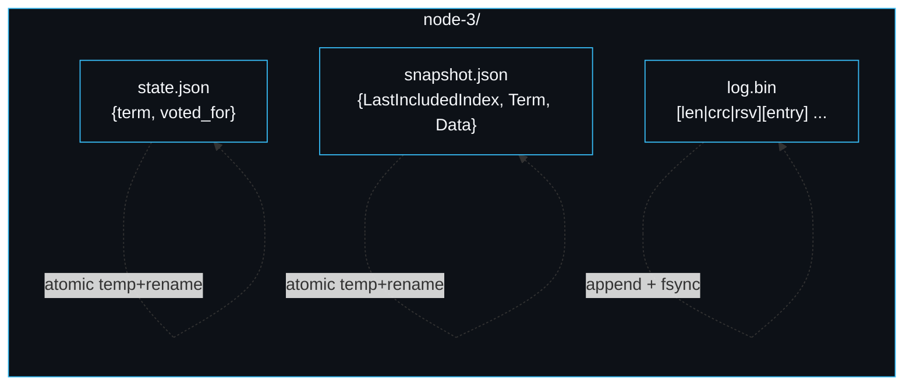
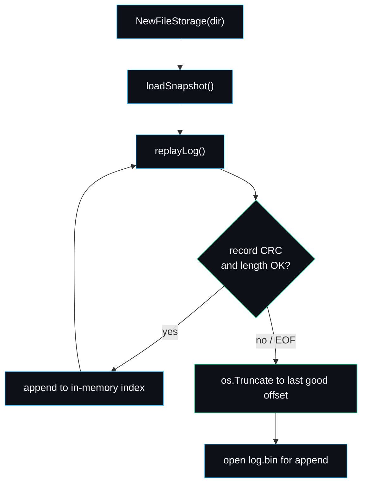

# Storage Engine

Persistence is where a Raft implementation either keeps its promises or quietly breaks them. The contract is blunt: anything the core has acknowledged to a peer or a client must already be on disk, so that a crash can lose only work that was never confirmed. This page is about `raft.FileStorage` in `raft/storage.go`, the single concrete implementation of the `Storage` interface.

## The contract

```go
type Storage interface {
    SaveState(term uint64, votedFor int) error
    LoadState() (term uint64, votedFor int, err error)

    AppendLog(entries []transport.LogEntry) error
    TruncateSuffix(from uint64) error
    Entries(lo, hi uint64) ([]transport.LogEntry, error)
    FirstIndex() (uint64, error)
    LastIndex() (uint64, error)

    SaveSnapshot(snap Snapshot) error
    LoadSnapshot() (Snapshot, bool, error)

    Close() error
}
```

The core leans on two ordering rules, and the rest follows from them.

1. `SaveState` is called before the core responds to any RPC that mutates `currentTerm` or `votedFor`. That is what stops a node from voting twice in one term across a crash: the vote is durable before the grant goes out (`persistStateLocked` in `raft/raft.go`).
2. `AppendLog` returns only after the entries are durable. The leader does not count a follower's `matchIndex` toward commitment until the follower has acknowledged, and a follower does not acknowledge until `AppendLog` has returned. So a committed entry is on a majority of disks.

`Entries`, `FirstIndex` and `LastIndex` are snapshot-aware: after compaction the first live index moves past the discarded prefix, and a request for a compacted range returns an error rather than a wrong answer, which is the signal the core uses to fall back to `InstallSnapshot`.

## What is on disk

A node's directory is `node-<id>/` and holds exactly three files.

| File | Format | Written by | Purpose |
| --- | --- | --- | --- |
| `state.json` | JSON `{term, voted_for}` | `SaveState` | Persistent term and vote. |
| `log.bin` | length-prefixed CRC records | `AppendLog`, `rewriteLog` | The replicated log. |
| `snapshot.json` | JSON `Snapshot` | `SaveSnapshot` | The compaction anchor and state-machine bytes. |

The exact byte layout is on [[Wire-Formats-and-Data-Layout]]. The short version: each log record is a 12-byte header (4-byte big-endian length, 4-byte CRC32 of the payload, 4 reserved bytes) followed by the JSON-encoded `LogEntry`.



State and snapshot are small and are written whole, so they use write-to-temp-then-rename (`writeJSONAtomic`): a partial write can never be observed because `rename` is atomic on the local filesystem. The log is large and append-heavy, so it gets the opposite treatment: an append-only file with per-record checksums, recovered by truncation.

## Append path

`AppendLog` marshals each entry, writes the header and payload, mirrors the entry into an in-memory slice for fast `Entries` lookups, and finishes with a single `fs.logFile.Sync()`. The `Sync` is the durability point. Batching the `fsync` to once per `AppendLog` call rather than once per entry is the only throughput concession in the write path, and it is safe because the core hands a whole batch of entries to one call.

```go
func (fs *FileStorage) AppendLog(entries []transport.LogEntry) error {
    for _, e := range entries {
        buf, _ := json.Marshal(e)
        var hdr [12]byte
        binary.BigEndian.PutUint32(hdr[0:4], uint32(len(buf)))
        binary.BigEndian.PutUint32(hdr[4:8], crc32.ChecksumIEEE(buf))
        fs.logFile.Write(hdr[:])
        fs.logFile.Write(buf)
        fs.entries = append(fs.entries, e)
    }
    return fs.logFile.Sync()
}
```

## Replay and torn-write recovery

This is the part worth slowing down for, because it is the mechanism a reviewer most wants to see and the reason I did not bury the log inside SQLite or bbolt (see [[Design-Decisions]]).

On open, `replayLog` reads `log.bin` record by record. For each it reads the 12-byte header, then `length` bytes of payload, then checks the CRC. A read that hits `EOF` or `ErrUnexpectedEOF` part-way through a header or body, or a payload whose CRC does not match, is treated as a torn write from a crash mid-append: the loop stops, and `os.Truncate` cuts the file back to the offset of the last good record.

```go
for {
    var hdr [12]byte
    if _, err := io.ReadFull(r, hdr[:]); err != nil {
        if err == io.EOF || err == io.ErrUnexpectedEOF {
            break // clean end or torn header: stop here
        }
        return err
    }
    length := binary.BigEndian.Uint32(hdr[0:4])
    want := binary.BigEndian.Uint32(hdr[4:8])
    buf := make([]byte, length)
    if _, err := io.ReadFull(r, buf); err != nil {
        break // torn body
    }
    if crc32.ChecksumIEEE(buf) != want {
        break // corrupted trailing record
    }
    // ... unmarshal, append, advance good offset ...
}
os.Truncate(fs.logPath, good)
```

The invariant this protects: a half-written trailing entry was, by definition, never acknowledged, because `AppendLog` had not returned and so the core never counted it. Discarding it loses nothing that was promised. `TestTornTrailingRecordDiscarded` in `raft/storage_test.go` appends deliberate garbage after a clean run and asserts that reopening keeps the good entries and drops the torn tail.



The honest limit: a corruption in the *middle* of the log, not the trailing record, is not recoverable. `replayLog` stops at the first bad record and truncates everything after it, which would silently drop good entries that followed a corrupted one. In practice torn writes are always at the tail because that is where appends happen; a mid-log bit flip is a disk fault outside the failure model. This is stated plainly rather than papered over.

## Truncation and rewrite

When a follower receives entries that conflict with its log, the core calls `TruncateSuffix(from)`. Because the log is append-only, removing a suffix means rewriting the file: `rewriteLog` drops the in-memory entries at or after `from`, writes the survivors to `log.bin.tmp`, fsyncs, and renames over `log.bin`. Rewriting the whole log on a truncation is acceptable because conflicting suffixes are rare and short in a healthy cluster; the common path, plain append, never rewrites. `TestTruncateSuffix` exercises this directly.

`SaveSnapshot` uses the same rewrite path to discard the compacted prefix after persisting the snapshot. See [[Snapshots-and-Compaction]].

## In-memory index

`FileStorage` keeps a slice of every live `LogEntry` in memory alongside the file. `Entries`, `FirstIndex` and `LastIndex` are served from the slice, so the hot path never re-reads the disk. The file is the durable record; the slice is the index. They are kept in step on every append, truncate and snapshot. The cost is memory proportional to the live (uncompacted) log, which is bounded by `SnapshotThreshold` once snapshotting is enabled.

## Failure modes worth knowing

- A `Sync` that fails returns an error from `AppendLog`, which the core surfaces. The entry is not acknowledged, so the cluster treats it as not-yet-replicated and the leader retries on the next heartbeat.
- If `state.json` is present but `log.bin` is missing (a fresh store, or a wiped log directory), the node starts with the persisted term and vote but an empty log. This is the expected state after `os.MkdirAll` on first boot.
- A snapshot whose `LastIncludedIndex` is behind the live log is ignored on load; the live log is authoritative for indices it still holds.

---
SarmaLinux . sarmalinux.com . [raftkv on GitHub](https://github.com/sarmakska/raftkv)
