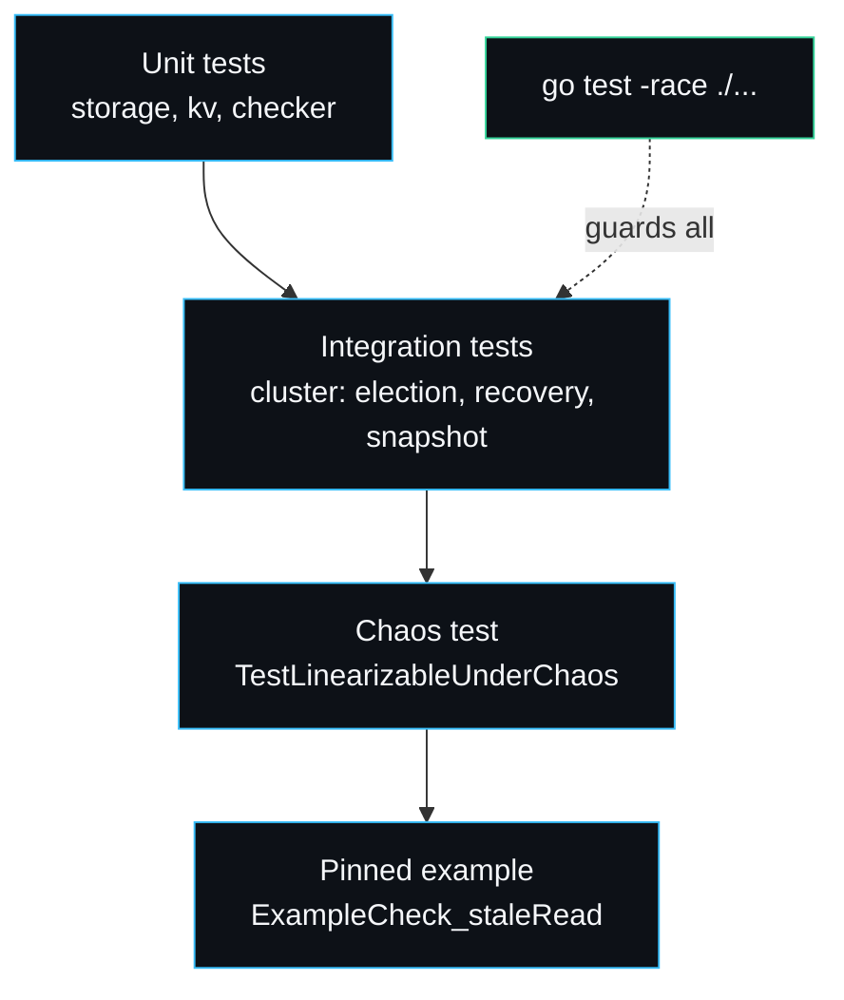

# Testing Strategy

The testing approach inverts the usual order: I wrote the checker and the fault harness first and treated them as the product, then built the Raft core to satisfy them. The rule I held to is that no consistency claim ships without a recorded history a checker has accepted. This page is the full test inventory, what each test pins, and how the flagship chaos test is constructed.

## The inventory

37 entries across the packages (36 `Test*` functions plus one runnable `Example`), two benchmarks. `go test -race ./...` is clean. CI (`.github/workflows/ci.yml`) runs gofmt, `go vet`, build, and `go test -race ./...` on push and pull request.

### cluster (`cluster/cluster_test.go`)

| Test | What it pins |
| --- | --- |
| `TestElectsLeader` | A fresh cluster elects exactly one leader within the timeout. |
| `TestBasicReadWrite` | Put, then linearizable Get returns the value, then Delete makes it absent. |
| `TestElectionAfterPartition` | Isolating the leader forces the surviving majority to elect a new one. |
| `TestLogConvergesAfterHeal` | A minority partitioned out catches up every write after the heal. |
| `TestLeadershipChange` | Crashing the leader hands over cleanly and the committed entry survives. |
| `TestRecoveryOfCommittedEntriesFromDisk` | Crash and restart every node; committed data is intact from disk. |
| `TestSnapshotInstall` | A far-behind follower is caught up via `InstallSnapshot`, not `AppendEntries`. |
| `TestLinearizableUnderChaos` | The flagship: a workload under the nemesis produces a linearizable history. |

### raft (`raft/storage_test.go`)

| Test | What it pins |
| --- | --- |
| `TestStateRoundTrip` | Term and vote survive a close and reopen. |
| `TestLogAppendAndReload` | Appended entries survive a reopen with the right last index. |
| `TestTruncateSuffix` | `TruncateSuffix` drops the suffix and the rewrite matches on reload. |
| `TestTornTrailingRecordDiscarded` | A simulated crash mid-append: the torn record is dropped, good entries survive. |
| `TestSnapshotCompactsLog` | `SaveSnapshot` discards the covered prefix and advances the first index. |

### linz (`linz/checker_test.go`, `history_test.go`, `example_test.go`)

| Test | What it pins |
| --- | --- |
| `TestSequentialValidHistory` | A simple non-overlapping valid history is accepted. |
| `TestConcurrentValidHistory` | Overlapping writes where a read sees either are legal. |
| `TestStaleReadIsRejected` | A read of an overwritten value is rejected. |
| `TestReadOfUnwrittenValueRejected` | A read of a never-written value is rejected. |
| `TestDeleteThenGetNil` | Delete then a Get of the absent key is legal. |
| `TestUnconfirmedWriteIsFlexible` | An unconfirmed write may or may not have applied; both later reads are legal. |
| `TestPerKeyIndependence` | Keys are checked independently; a violation on one is isolated to that key. |
| `TestRecordedHistoryAccepted` | A recorded valid history is accepted. |
| `TestCorruptedHistoryRejected` | A valid history with one read corrupted to a stale value is rejected. |
| `TestEmptyHistoryIsLinearizable` | The empty history is trivially linearizable. |
| `ExampleCheck_staleRead` | The runnable, output-pinned violation (also in the README). |

### kv (`kv/kv_test.go`)

`TestApplyAndGet`, `TestSnapshotRestore`, `TestEncodeDecodeRoundTrip` pin the state machine: apply semantics, snapshot round trip, command encoding.

### fault (`fault/fault_test.go`)

The harness that injures the cluster is itself a piece of code that can be wrong, so it is pinned directly rather than only through the chaos test. The `Injector` is pure, seeded logic, which makes it cheap and deterministic to test.

| Test | What it pins |
| --- | --- |
| `TestInjectorNoFaults` | A fresh injector delivers every message, including a node to itself, with no delay. |
| `TestInjectorPartition` | A partition is a hard cut: within-group always delivers, cross-group never does, symmetrically. |
| `TestInjectorPartitionUnlistedNodeStaysConnected` | A node named in no group reaches both sides; the listed nodes stay cut. |
| `TestInjectorIsolate` | `Isolate` cuts exactly one node off and leaves the surviving majority connected. |
| `TestInjectorHeal` | `Heal` clears partition, drop rate and delay so the cluster is whole again. |
| `TestInjectorDropRateBounds` | Drop rate 1.0 drops everything; 0.0 drops nothing, regardless of seed. |
| `TestInjectorDropRateIsSeededAndReproducible` | A partial drop rate is honoured statistically and identical under a fixed seed. |
| `TestInjectorDelayWindow` | Every delivered message is delayed inside the configured `[min, max]` window. |
| `TestInjectorFixedDelay` | A window where `min == max` applies that delay exactly. |
| `TestInjectorCheckOrdering` | The partition cut takes precedence and a dropped message carries no delay. |

## The layers of confidence



- **Unit tests** pin the pieces in isolation: a storage round trip, a torn-write recovery, the checker accepting and rejecting specific histories.
- **Integration tests** run a real multi-node cluster with real timers and assert protocol-level outcomes: a new leader after a partition, log convergence after a heal, data intact after crashing every node.
- **The chaos test** is the one that earns the project its claim. It drives a workload while the nemesis attacks and asserts the recorded history is linearizable.
- **The pinned example** guarantees the checker keeps catching the canonical violation; its expected output is in the source, so a regression turns the test red.

## The flagship test, built up

`TestLinearizableUnderChaos` (`cluster/cluster_test.go`):

```go
c, _ := cluster.New(fastOpts(5, t.TempDir()))
history := linz.NewHistory()
cl := cluster.NewClient(c, 5*time.Second, history)   // records every op

nm := fault.NewNemesis(c, 42)                          // seeded
nm.Run(500 * time.Millisecond)                         // partitions, drops, delays, crashes

keys := []string{"x", "y", "z"}
for i := 0; i < 120; i++ {
    k := keys[i%len(keys)]
    if i%3 == 2 { cl.Get(k) } else { cl.Put(k, fmt.Sprintf("v%d", i)) }
}
nm.Stop()                                              // heal and restart any crashed node

res := linz.Check(history)
if !res.Linearizable { t.Fatalf("violation on key %q: %s", res.Key, res.Reason) }
```

Three things make this a real test rather than a smoke test. The nemesis is seeded, so the fault schedule is reproducible (to the granularity of the timing jitter Raft itself adds). The workload spreads across three keys, which keeps the per-key checker fast (see [[Linearizability-Checker]]). And the client records the *observed* value on every read, so the history reflects what the cluster actually returned, not what the test hoped for.

## Flakiness and timers

The integration tests drive real wall-clock timers, so an unusually slow scheduler can push an election past a deadline. The default timeouts leave generous headroom, and the consensus logic depends only on the election window being larger than the heartbeat, not on absolute values. On a loaded machine you can widen the `waitLeader` deadlines or the `fastOpts` timeouts. See [[Troubleshooting]] for the flaky-test entry.

## Why the race detector matters here

The core fans RPCs out on goroutines that re-acquire the node lock to apply replies (see [[Architecture]]), the apply loop runs on its own goroutine woken by a `sync.Cond`, and the store is touched by both the apply pump and the read path. That is a lot of concurrency around shared state, so `go test -race ./...` in CI is not a formality; it is the guard that the `Locked` discipline actually holds.

---
SarmaLinux . sarmalinux.com . [raftkv on GitHub](https://github.com/sarmakska/raftkv)
