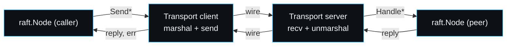

# Writing a Transport

The one thing that turns raftkv from an in-process demonstration into something that could run across machines is a real transport. The seam already exists: every node talks only through `transport.Transport`, and the in-memory `cluster.Endpoint` is just one implementation. This page is the contract a real transport must honour and the gotchas the in-memory one hides. Putting a real transport behind this seam is the headline item on the [[Roadmap]].

## What you implement

```go
type Transport interface {
    SendRequestVote(target int, args *RequestVoteArgs) (*RequestVoteReply, error)
    SendAppendEntries(target int, args *AppendEntriesArgs) (*AppendEntriesReply, error)
    SendInstallSnapshot(target int, args *InstallSnapshotArgs) (*InstallSnapshotReply, error)
}
```

Each method sends one RPC to one peer and returns its reply, or an error if the peer was unreachable. On the receiving side you call the matching `Handler` method on the local `raft.Node`, which already implements `Handler`:

```go
type Handler interface {
    HandleRequestVote(args *RequestVoteArgs) *RequestVoteReply
    HandleAppendEntries(args *AppendEntriesArgs) *AppendEntriesReply
    HandleInstallSnapshot(args *InstallSnapshotArgs) *InstallSnapshotReply
}
```

So a real transport is two halves: a client that serialises the argument types over a wire and a server that deserialises them, calls the handler, and serialises the reply back. The argument and reply types and their exact fields are on [[Wire-Formats-and-Data-Layout]].



## The contract the core relies on

The core is written to tolerate a hostile network, so the contract is deliberately weak. A correct transport must satisfy only this:

1. **Synchronous from the caller's view.** A `Send*` call returns either a reply or an error. It does not have to be reliable; it has to be honest about failure.
2. **An error means unreachable, not a wrong answer.** If you cannot get a reply (timeout, connection refused, deserialisation failure), return an error. Never fabricate a reply. The core treats an error as "no information" and retries; a fabricated reply could violate safety.
3. **No mutation of the arguments.** Treat the `*Args` you receive as read-only on the send side. The core may reuse or inspect them.
4. **Replies carry the responder's term.** Every reply type has a `Term` field; you must round-trip it faithfully, because the core uses a higher term in a reply to step down. Dropping it would break leader-stepdown.

The core copes with drops, delays, reordering and duplication on its own. You do not need to add reliability; you need to add a wire.

## What the in-memory transport hides

The in-memory `Endpoint` makes some things free that a real transport must handle.

- **Serialisation.** In-memory, the `*Args` is passed by pointer; nothing is encoded. Over a wire you must serialise it. The types are plain structs of `uint64`, `int`, `string`, `bool` and `[]byte`, so any encoding works; the on-disk format already proves JSON is sufficient.
- **Large snapshots.** `InstallSnapshot` carries the whole snapshot in one `Data` field. In-memory that is a pointer copy. Over a wire a multi-megabyte snapshot in one message is awkward; a real transport would likely chunk it and reassemble, which is noted on the [[Roadmap]]. The core does not require chunking, but a production transport would want it.
- **Authentication and confidentiality.** In-memory there is no wire, so there is nothing to authenticate or encrypt. A real transport must add mutual authentication (most likely mutual TLS) because Raft assumes peers are who they claim to be; a forged higher-term `AppendEntries` would force a real leader to step down. See [[Security-Model]].
- **Connection lifecycle.** In-memory, a "crashed" node is simply absent from the handler map and `gate` returns `ErrUnreachable`. A real transport must map a closed or refused connection to that same error so the core's retry logic behaves identically.

## Wiring it in

The cluster hands each node its transport in `startNode`:

```go
cfg := raft.Config{
    ID:        id,
    Peers:     c.peers,
    Storage:   storage,
    Transport: c.net.EndpointFor(id), // <- replace this with your transport
    // ... timers, ApplyCh ...
}
```

To use a real transport, replace `c.net.EndpointFor(id)` with your implementation and stand up the server side that routes inbound RPCs to `rn.Handle*`. No consensus code changes, because the core only ever sees the `Transport` interface. That isolation is the whole reason the seam exists (see [[Transport-and-Network]] and [[Design-Decisions]]).

## A minimal sketch

A real transport's send side, in outline:

```go
func (t *GRPCTransport) SendAppendEntries(target int, args *transport.AppendEntriesArgs) (*transport.AppendEntriesReply, error) {
    conn, err := t.conn(target)        // dial or reuse, return err if unreachable
    if err != nil {
        return nil, err                // honest failure, the core will retry
    }
    reply, err := conn.AppendEntries(t.ctx, encode(args))
    if err != nil {
        return nil, err
    }
    return decode(reply), nil          // round-trip Term faithfully
}
```

The server side registers a handler that decodes, calls `node.HandleAppendEntries`, and encodes the reply. That is the entire surface. The hard parts of consensus are already done; a transport only has to move bytes honestly.

---
SarmaLinux . sarmalinux.com . [raftkv on GitHub](https://github.com/sarmakska/raftkv)
